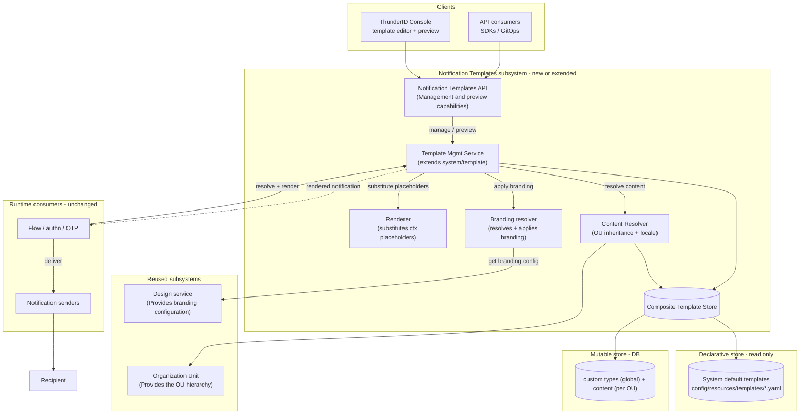
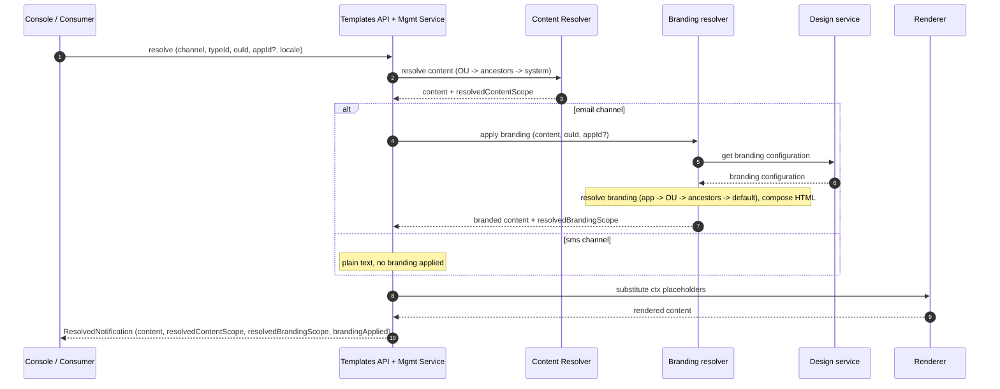
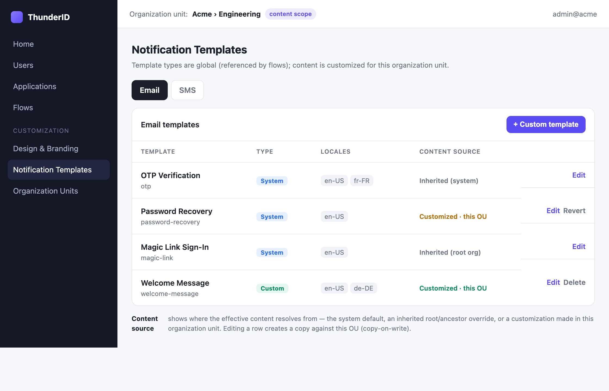
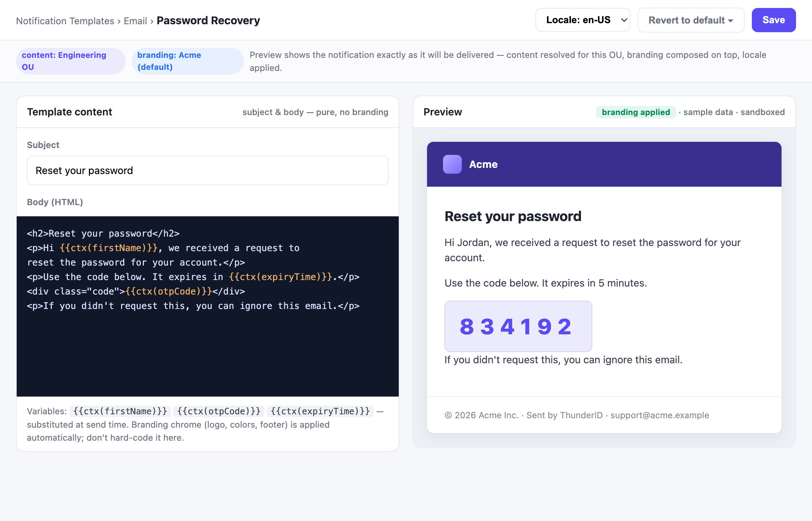

# Notification Templates Specification

- **Status:** Draft
- **Version:** 0.1
- **Related documents:** Feature request issue (TBD); `api/notification-templates.yaml`; Design API (`api/design.yaml`); threat-model.md (this feature)

## Summary

ThunderID ships a fixed set of notification templates that today can only be changed by editing files on the
server and restarting. Administrators cannot view, customize, extend, localize, or brand these
messages at runtime — which is impossible in a hosted deployment and below the baseline of peer
identity products.

This feature makes notification templates manageable through the ThunderID Management API and Console. The governing design decisions are:

1. **System templates are declarative and customizable at the organization level.** The shipped
   system templates themselves are read-only; all customization is an override performed in the
   context of an **organization unit (OU)** and inherits down the OU hierarchy. This mirrors
   ThunderID's existing declarative/composite store model.
2. **Template types are managed globally; content is customized per OU.** Template *types* (the set of
   templates, system and custom) are managed at the root/global level, because they are referenced by
   flows, which are themselves defined globally — a type only becomes usable when a flow engages it, so
   defining types per OU would serve no purpose. Full lifecycle management of custom *types* (create,
   read, update, delete, list) is global; an organization unit customizes the *content* (per type and
   locale), not the type set.
3. **Template inheritance is reference-until-edited (copy-on-write).** A notification template resolves
   in the order OU → ancestor OUs → system. An OU that has not customized a template resolves it by
   reference, so changes to the original remain visible to every OU below it. Once an OU edits a
   template, the modified copy is stored against that OU and takes precedence for that OU and its
   descendants.
4. **Templates are independent resources.** A template is identified by notification channel, template
   type, and locale, and is resolved within an OU context; an OU's customization is stored against that
   OU. Notification template management does not own or store branding configuration — branding is
   sourced from the existing Design feature.
5. **Branding is composed at render time.** Branding is applied on top of the resolved template when the
   notification is rendered, and resolves application → OU → ancestor OUs → default. The content and
   branding chains resolve independently, so a single delivered message may take its content and its
   branding from different scopes (content has no application tier; branding does).

## Architecture

The feature extends the existing notification-template subsystem and reuses existing subsystems
(Design, OU/application) rather than introducing parallel ones. Template **content** is owned by
this subsystem; template **branding** is owned by Design. They meet only in the channel-aware render
pipeline (branding resolver + renderer).

### Component view



### Resolution / render flow



### Components

| Component | Role | Status |
|---|---|---|
| `internal/system/template` | Template resolve + `{{ctx(...)}}` render pipeline | Extend: add mutable write path, scope + locale keys |
| Composite template store | System defaults (declarative, read-only) + OU overrides + custom types (DB) | New mutable layer over the declarative file store — same pattern as `design/theme` |
| `internal/design` (`/design/resolve`) | Branding source (logo, colors, header/footer, org name, copyright) | Reuse: composed at render |
| `internal/ou`, `internal/application` | OU hierarchy and app→OU membership for resolution | Reuse |
| Flow / authn / OTP consumers + notification senders | Trigger and deliver notifications | Unchanged interface — benefit transparently |

## Detailed design

The feature has two parts: **template management** — defining types and authoring content — and
**runtime usage** — a flow rendering a branding-applied template and resolving its placeholders before
sending. The conceptual subsections below are grouped accordingly; the fixed subsections (data model,
API, UI, configuration) follow.

### Part 1 — Template management

#### Scope: types are global, content is per OU

- **Template types** (system and custom — e.g. OTP, password recovery) are managed at the
  **root / global** scope, because:
  - a type is only used when a **flow** engages it — a flow node selects a template type for its
    notification channel; and
  - flows are defined globally, so a per-OU type would serve no purpose.
- **Content** (subject and body, per type and locale) can be authored at the root org or any OU.
  Content defined at the root org (or a parent OU) is inherited down the OU hierarchy and is
  **overridable at any OU**.

#### System vs. custom templates

- **System templates** are the shipped scenarios (OTP, magic-link, user-invite, self-registration,
  password-recovery, CIBA). They are **declarative** (loaded from `config/resources/templates/*.yaml`)
  and **read-only**: they cannot be created or deleted through the API. Their content can be
  *overridden* (root or OU) and reverted to the shipped default.
- **Custom templates** are administrator-defined types created **globally** so flows can reference
  them. The type is fully mutable (create / read / update / delete).

The store is **composite**: declarative entries are marked read-only (`isSystem: true`); mutable
entries (root/OU content and custom types) live in the database. This is the same pattern
`design/theme` uses (`isReadOnly` file vs. DB entries).

#### Content is stored pure; branding is separate

Stored templates contain only `contentType`, `subject` (email), and `body`. They never embed branding
markup, so a single branding change applies everywhere without editing any template. Notification
template management does **not** own or store branding configuration; branding is sourced from the
Design feature and composed at render time.

Because content is stored pure, the template editor provides a **preview**: it renders the resolved
content with the applicable branding and locale applied — exactly as the recipient will receive it —
inside the template UI, so an administrator authors only the pure content while still seeing the final,
branded message.

#### Inheritance: reference-until-edited (copy-on-write) and revert behavior

Content resolves in the context of an OU, by precedence:

```
OU override -> ancestor OU overrides (up to the root org base) -> system default (system types only)
```

- An OU that has **not** customized a template resolves it **by reference**, so changes to the base
(root org, or an ancestor) remain visible to every OU below. 
- Once an OU **edits** a template, the
modified copy is stored against that OU and takes precedence for that OU and its descendants. 
- Revert has two targets: **to
parent** (drop this OU's override, inherit the immediate parent's effective value) and **to system**
(reset to the shipped default, bypassing intermediate ancestor overrides — system types only; a custom
type has no shipped default).

#### Localization

A template type carries per-locale content, each an independent `(channel, typeId, ouId, locale)` entry
with its own subject and body. Locale identifiers are validated as well-formed BCP-47 tags. At render
time the recipient's locale is used, falling back to the default locale when no variant matches, so a
message is always produced.

#### Empty and missing states

- A template **type** may exist with no content (a newly created custom type). This is valid; listing
  returns it with an empty `locales` set.
- Distinct not-found conditions: the type does not exist; a specific locale variant does not exist; or
  nothing is resolvable at any scope/locale (an empty custom type). The last is surfaced as an explicit
  error at resolve/send time — an empty or fabricated message is never delivered.

### Part 2 — Runtime usage (flow-driven)

A template is used at runtime when a flow executes a node that sends a notification.

#### Send pipeline

When flow execution reaches that node (the email or SMS executor), the runtime:

1. resolves the **effective content** for the **flow's OU and the recipient's locale**;
2. obtains the **branding-applied** result;
3. **resolves the `{{ctx(...)}}` placeholders** with the runtime data;
4. hands the rendered message to the **notification senders** for delivery.

#### Branding at render time

Branding is applied **on top of** the resolved content. So a single delivered message may take its
content and its branding from different scopes (content has no application tier; branding does). 

**Dependency (bounded):** OU-branding *storage already exists* upstream — an `OrganizationUnit` carries
`themeId`, `layoutId`, and `logoUrl` (plus `name` and policy URIs), delivered by #1363/#1383. The only
missing piece is **resolution**: `design/resolve` supports `type=APP` and still has an explicit
`type=OU` + fallback `TODO`, and the resolve service is not yet wired to the OU service. So OU/ancestor
branding needs a **bounded** Design change (read `ou.themeId`/`logoUrl`, walk ancestors via the existing
`GetAncestorOUIDs`, fall back to default) — not a new subsystem. Until it lands, branding resolves at
the **application tier** (always available at runtime, since flows carry an `appId`); content and flow
behaviour are unaffected.

#### Compatibility with flows

No structural change to flows is required. The flow execution context already carries the recipient's
organization unit (`OUID`) and locale (the required-locale runtime value), and flows are global with
OU-aware effective resolution (`ResolveEffectiveFlowID`). The email/SMS executors currently call
`Render(scenario, channel, data)`; the only change is to pass the OU and locale (both in context) into
the extended resolution.

### Data model

- **Reused:** the declarative file store for system defaults (read-only); Design themes/layouts for
  branding; OU and application tables for the hierarchy and app→OU membership;
- **New (mutable/DB):**
  - **Custom-type metadata** keyed by **(channel, typeId)** — global, carrying `displayName` and
    `isSystem: false`.
  - **Content entries** keyed by **(channel, typeId, ouId, locale)** — the per-OU content overrides
    and custom-type content.
  - Entries are merged with declarative defaults by the composite store. No changes to Design schemas.

### API

New spec: `api/notification-templates.yaml` (OpenAPI 3.0.3, `OAuth2: [system]`). Flat paths. **Type
management is global** (no `ouId`) because types are referenced by flows, which are root-defined;
**content, revert, resolve, and preview are OU-scoped** via `ouId` (a query parameter, or in the body
for `preview`).

| Method | Path | Scope | Purpose |
|---|---|---|---|
| GET | `/notification-templates/{channel}/types` | global | List types (system + custom) |
| POST | `/notification-templates/{channel}/types` | global | Create custom type (server assigns id; always custom) |
| GET | `/notification-templates/{channel}/types/{typeId}` | global | Get one type + its locales |
| PUT | `/notification-templates/{channel}/types/{typeId}` | global | Update custom type `displayName` (custom only) |
| DELETE | `/notification-templates/{channel}/types/{typeId}` | global | Delete custom type (custom only) |
| GET | `/notification-templates/{channel}/types/{typeId}/{locale}?ouId=` | OU | Get effective raw content |
| PUT | `/notification-templates/{channel}/types/{typeId}/{locale}?ouId=` | OU | Create/update OU content override |
| DELETE | `/notification-templates/{channel}/types/{typeId}/{locale}?ouId=` | OU | Delete OU variant/override |
| POST | `/notification-templates/{channel}/types/{typeId}/{locale}/revert?ouId=&target=` | OU | Revert to parent or system |
| GET | `/notification-templates/{channel}/types/{typeId}/resolve?ouId=&appId=&locale=` | OU | Resolve branding+locale-applied notification |
| POST | `/notification-templates/{channel}/types/{typeId}/preview` | OU | Preview with sample ctx data (`ouId` in body) |

Key models: `TemplateType` (`id`, `displayName`, `isSystem`, `locales`); `Template`
(`typeId`, `channel`, `locale`, `isSystem`, `isCustomized`, `content`) where `content` is the nested
pure `TemplateContent` (`contentType`, `subject`, `body`); `ResolvedNotification`
(`resolvedContentScope`, `resolvedBrandingScope`, `resolvedLocale`, `brandingApplied`, `content`).

- **Authorization:** `system` scope; unauthorized -> `AUTH-4010`, forbidden business rules ->
  `AUTH-4030`.
- **Validation:** channel, content type, required fields, referenced substitution variables, and
  locale (a well-formed BCP-47 tag) is validated; malformed input is rejected without persisting.
- **Errors:** shared `Error`/`I18nMessage` shape; domain prefix `NTM-XXXX`; shared `SSE-5000`,
  `AUTH-401x/403x`.

Method choice: `resolve` is GET (scalar inputs), `preview` is POST (carries a `sampleData` body) —
matching `design/resolve` (GET) and AuthZEN evaluate/search (POST reads).

### UI

Console feature under the notifications section. Mockups (source: `assets/*.html`, rendered to PNG).

#### Template list



Per-channel tabs (Email / SMS). The **type** catalog is global (system + custom), while the
**Content source** column shows where each template's effective content resolves from for the current
organization unit — *inherited (system)*, *inherited (root org / ancestor)*, or *customized · this OU*.
`+ Custom template` creates a global custom type; **Edit** opens the editor (copy-on-write against this
OU); **Revert** appears only where this OU has an override; **Delete** only for custom types.

#### Template editor with live branded preview



The editor keeps **content pure** — subject and body with `{{ctx(...)}}` variables highlighted, no
branding markup. The right pane is a **live preview** of the notification exactly as delivered:
resolved content + composed branding (logo, colors, header/footer) + selected locale + sample data.
The scope pills make the two chains explicit (*content: Engineering OU*, *branding: Acme*). The
preview renders in a **sandboxed iframe** (scripts disabled), so a malicious template body cannot
execute in the Console.

The **SMS editor** omits subject and HTML, shows a plain-text body and a plain-text preview, and
applies no visual branding (`brandingApplied: false`).

### Configuration

- **Store mode** for notification templates: `declarative` | `mutable` | `composite` (default
  `composite`), consistent with other resources (e.g. `OrganizationUnit.Store`). Composite = shipped
  declarative defaults plus DB overrides.
- **Default locale** for fallback: a configurable default locale (for example en-US); the platform default is used if unset.

No other deployment-level configuration is introduced.

## Requirements

### R1. Manage templates through API and Console

**Requirement:** An administrator can manage notification templates through both the
Management API and the Console, with equivalent operations and consistent results.

**Acceptance criteria:**

- **AC1.1:** Given a channel, when the administrator lists types, then the global set (system and
  custom) is returned, each tagged `isSystem`.
- **AC1.2:** Given the same operation performed via API and via Console, when it completes, then both
  produce the same result.
- **AC1.3:** Given a caller without the `system` scope, when any template operation is invoked, then it
  is rejected with `AUTH-4010`/`AUTH-4030`.

### R2. System templates are read-only with revert

**Requirement:** System (shipped) templates cannot be created or deleted; they can be viewed, overridden
at an OU, and reverted either to the immediate parent's value or to the shipped system default.

**Acceptance criteria:**

- **AC2.1:** Given a system type, when a create or delete of the type is attempted, then it is refused
  with `AUTH-4030`.
- **AC2.2:** Given a system template overridden at an OU, when the administrator reverts a locale
  variant with target `PARENT`, then the OU's override is removed and the variant inherits the
  immediate parent's effective value.
- **AC2.3:** Given a system template overridden at an OU whose ancestor also overrides it, when the
  administrator reverts with target `SYSTEM`, then the variant is reset to the shipped system default,
  bypassing the ancestor override.
- **AC2.4:** Given a custom type, when a revert with target `SYSTEM` is requested, then it is rejected
  (no shipped default exists).

### R3. Custom template types (global)

**Requirement:** An administrator can create, retrieve, update, and delete custom template types
**globally**; the server assigns the id and the type is always custom. Types are global because they
are referenced by flows.

**Acceptance criteria:**

- **AC3.1:** Given a create request with only `displayName` (no `ouId`), when it succeeds, then a
  global type with a server-assigned `id` and `isSystem: false` is returned with a `Location` header.
- **AC3.2:** Given a custom type, when `displayName` is updated, then only the label changes; `id`,
  `channel`, and `isSystem` are unchanged.
- **AC3.3:** Given a custom type, when it is deleted, then the type and all of its content across
  organization units are removed; a system type cannot be deleted (`AUTH-4030`).
- **AC3.4:** Given the type catalog, when any organization unit lists types, then it sees the same
  global set (system + custom); types are not defined or scoped per OU.

### R4. Edit content per channel

**Requirement:** Email templates expose subject and body; SMS templates expose body only; both support
`{{ctx(...)}}` variables and the applicable content type.

**Acceptance criteria:**

- **AC4.1:** Given an email variant, when saved, then `contentType`, `subject`, and `body` persist.
- **AC4.2:** Given an SMS variant, when saved, then only `body` (plain text) persists; a subject is not
  required or accepted.
- **AC4.3:** Given input with an unknown channel, unsupported content type, missing required field, or
  unresolvable variable, when submitted, then it is rejected (`NTM-XXXX`) and nothing is persisted.

### R5. Localization

**Requirement:** A template carries per-locale variants managed independently, with default-locale
fallback at send time.

**Acceptance criteria:**

- **AC5.1:** Given a template, when a locale variant is added/edited/deleted, then other locales are
  unaffected.
- **AC5.2:** Given an invalid locale tag, when submitted, then it is rejected as a malformed BCP-47 tag and nothing
  is persisted.
- **AC5.3:** Given a recipient locale with no matching variant, when a notification is sent, then the
  default-locale variant is used.

### R6. Content resolution and inheritance

**Requirement:** Effective content resolves by OU -> ancestor OUs (up to the root org base) -> system
default, isolated per OU, with reference-until-edited (copy-on-write) semantics.

**Acceptance criteria:**

- **AC6.1:** Given an OU with no override, when content is resolved, then it falls back to the nearest
  ancestor override (up to the root org), then the system default.
- **AC6.2:** Given an override at OU A, when content is resolved for OU B, then B is unaffected.
- **AC6.3:** Given an OU that has not customized a template, when the inherited (root-org or ancestor)
  content changes, then the OU sees the updated content by reference; once the OU edits the template,
  it keeps its own copy, independent of later base changes.

### R7. Branding is independent and reused from Design

**Requirement:** Branding is customized and resolved independently of template content, sourced from the
Design service; changing one does not change the other.

**Acceptance criteria:**

- **AC7.1:** Given a branding change in Design, when a notification is resolved, then the new branding
  is applied without any template-content change.
- **AC7.2:** Given a template-content change, when branding is resolved, then branding is unaffected.

### R8. Branding resolution and channel-awareness

**Requirement:** Branding resolves by application -> OU -> ancestor OUs -> default; visual branding
applies to email only.

> **Dependency (bounded):** OU-branding storage already exists — an `OrganizationUnit` carries
> `themeId`, `layoutId`, and `logoUrl` (#1363/#1383). The OU/ancestor tiers depend only on `design/resolve`
> gaining `type=OU` + fallback (an explicit upstream `TODO`; the resolve service also needs the OU
> service wired in) — see Detailed design → Branding at render time. The application tier and the
> email-only rule are available today.

**Acceptance criteria:**

- **AC8.1:** Given an application with its own branding, when resolved for that application, then the
  application branding is applied.
- **AC8.2:** Given an application with no branding, when resolved, then resolution falls back to OU,
  ancestors, then default *(dependent on Design OU resolution)*.
- **AC8.3:** Given an SMS notification, when resolved, then the result is plain text, `brandingApplied`
  is false, and no branding scope is reported.

### R9. Resolve and preview

**Requirement:** Resolve returns the effective, branding- and locale-applied notification; preview does
the same with sample `{{ctx}}` data.

**Acceptance criteria:**

- **AC9.1:** Given a type, an `ouId`, and optionally an `appId`, when resolve is called, then the
  composed content plus `resolvedContentScope`, `resolvedBrandingScope`, `resolvedLocale`, and
  `brandingApplied` are returned.
- **AC9.2:** Given sample data, when preview is called, then the response shows the notification with
  variables substituted; the Console renders it in a sandboxed iframe.

### R10. Defaults, migration, and delivery

**Requirement:** Existing behavior is preserved after upgrade until an administrator customizes a
template or branding.

**Acceptance criteria:**

- **AC10.1:** Given an upgraded deployment, when no customization exists, then the same notifications
  are sent as before, with the shipped scenarios and channels available as system defaults.
- **AC10.2:** Given a customized template, when a flow or authentication path sends the notification,
  then the customized, localized, branded content is delivered without a server restart.
- **AC10.3:** Given a template type with no resolvable content, when a send is attempted, then an
  explicit error is surfaced and no empty message is delivered.

## Change log

| Version | Date | Change |
|---|---|---|
| 0.1 | 2026-09-09 | Initial specification. |
