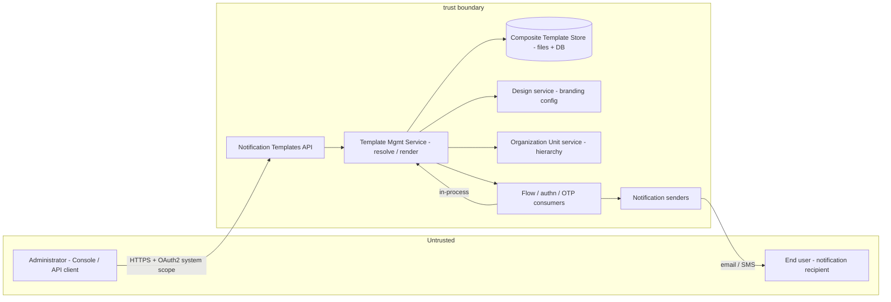
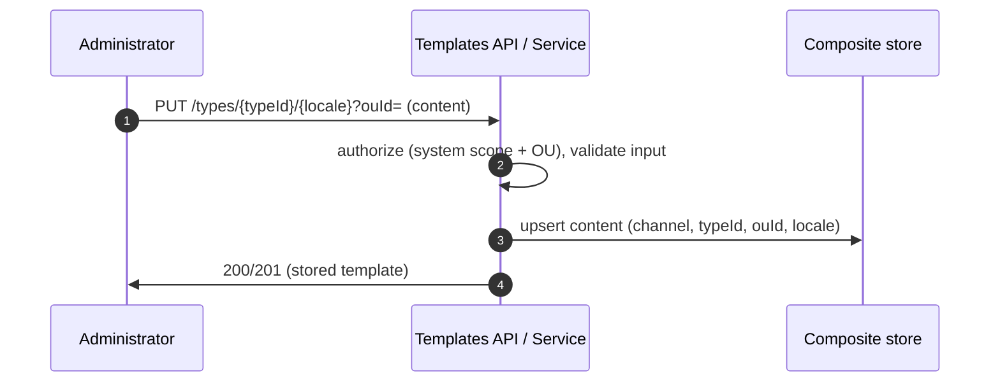
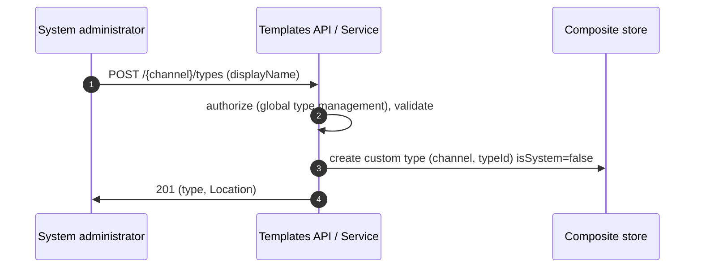
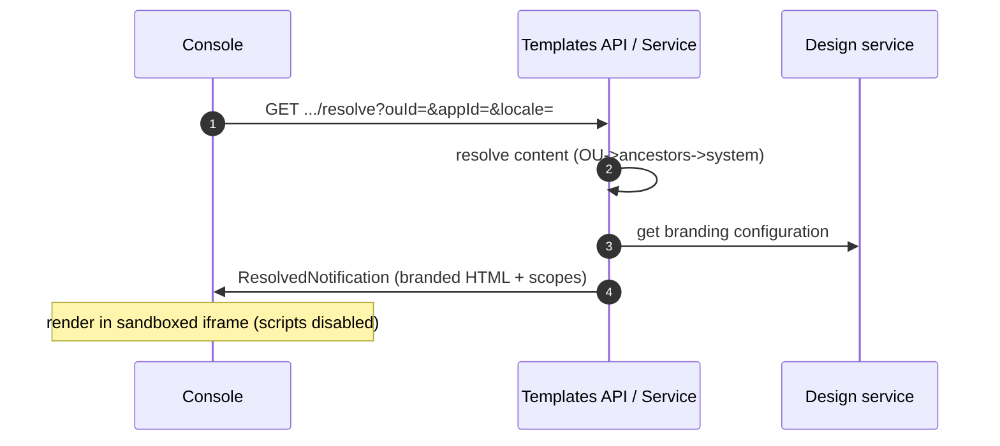
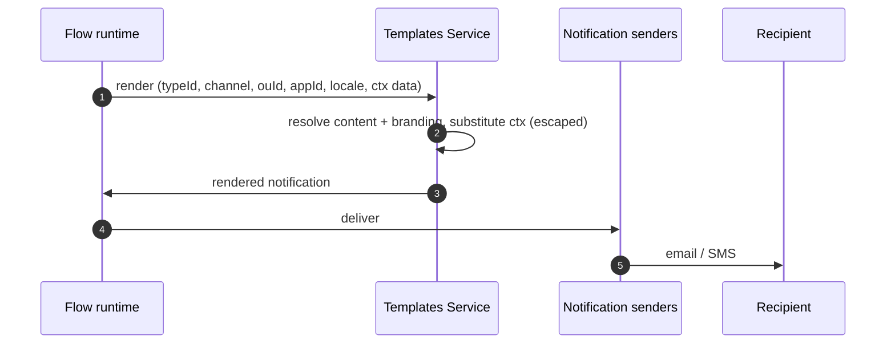

# Notification Templates Threat Model

This model covers the notification-templates feature: the management API and Console for authoring
email/SMS template types and content, and the runtime path that resolves, brands, renders, and hands a
notification to the senders.

## Overview

Notification templates define the email and SMS messages ThunderID delivers to end users (OTP,
recovery, invitation, and so on). Administrators author **pure content** (subject/body with
`{{ctx(...)}}` variables) through a `system`-scope API and Console; at send time a flow resolves the
effective content for the recipient's organization unit and locale, composes branding on top, and
substitutes variables before delivery. The security-relevant behaviour is: who may read/modify which
templates (authorization and tenant isolation), and what the authored template plus runtime data can do
when rendered and delivered (content/markup injection into the Console and into delivered messages).

Cross-cutting concerns covered elsewhere (referenced here as trust inputs, not re-analysed):
- **OAuth2 token issuance / client authentication** — issues the `system`-scope access token.
- **Design (branding) model** — owns theme storage and resolution; supplies branding configuration.
- **Flow execution model** — owns flow authentication, the application context (`appId`), and runtime
  data (user attributes) passed as `{{ctx(...)}}` values.

## Scope

This model covers:
- The `notification-templates` management endpoints: template **types** (global) and template
  **content** (per organization unit) — create/read/update/delete/revert.
- The **resolve** and **preview** read endpoints (composed, branding- and locale-applied output).
- The **runtime render + send** path invoked by flow/authn/OTP consumers.
- The **composite store** (declarative file defaults + mutable DB overrides) and its data.
- Rendering: `{{ctx(...)}}` substitution and branding composition into HTML/plain output, and the
  Console preview surface.

Out of scope (owned by the referenced companion models):
- Issuance and validation of the `system` access token (OAuth2 model).
- Branding/theme storage, integrity, and resolution internals (Design model).
- Flow authentication and the trustworthiness of `{{ctx(...)}}` runtime data at source (Flow model).
- Delivery transport to SMTP/SMS providers (Notification senders / provider configuration).

## Architecture

### Components

| Component | Task |
| --- | --- |
| Notification Templates API | Terminates HTTPS, enforces `system` scope, validates input (channel, content type, locale, body), routes to the service. Security-relevant: authorization and input validation boundary. |
| Template Mgmt Service | Orchestrates content resolution (OU → ancestors → system), branding composition, and `{{ctx}}` substitution. Enforces scope rules (types global, content per OU) and read-only system defaults. |
| Composite Template Store | Merges read-only declarative file defaults with mutable DB entries (custom types + per-OU content). Security-relevant: tenant-scoped keys `(channel, typeId, ouId, locale)`; declarative entries are immutable. |
| Design service | Supplies branding configuration for composition. Trusted input; not modified here. |
| Organization Unit service | Provides the ancestor chain used for content resolution and OU authorization checks. |
| Flow / authn / OTP consumers | Invoke render at send time with the recipient's OU, locale, and `{{ctx}}` runtime data. |
| Notification senders | Deliver the rendered message. Out of scope for content authoring. |

### Actors

#### Actors

| Actor | Description | Roles or permissions |
| --- | --- | --- |
| System administrator | Manages global template types and content at any organization unit. | `system` scope (root/global) |
| Organization-unit administrator | Customizes template content for a specific organization unit and its subtree. | `system` scope constrained to an OU (see residual on authz granularity) |
| Flow runtime (service) | Renders and sends notifications during flow execution. | In-process; no external credential |
| End user (recipient) | Receives the delivered email/SMS. | None |

#### Entitlement matrix

| Actor | Manage types (global) | Manage content (own OU subtree) | Manage content (other OU) | Resolve / preview (own OU) |
| --- | --- | --- | --- | --- |
| System administrator | [Yes] | [Yes] | [Yes] | [Yes] |
| Organization-unit administrator | [No] | [Yes] | [No] | [Yes] |
| Flow runtime (service) | [No] | [No] | [No] | [Yes] (render only) |
| End user (recipient) | [No] | [No] | [No] | [No] |

### External Dependencies (not owned)

| Dependency | Description |
| --- | --- |
| OAuth2 / token service | Issues and the API validates the `system` access token. Owned by the OAuth2 model. |
| Design service | Provides branding configuration composed into email. Integrity owned by the Design model. |
| Flow runtime + `{{ctx}}` data | Supplies recipient OU, locale, and user-attribute values substituted into templates. Source trust owned by the Flow model; this feature is responsible for **safe substitution** of those values. |
| Notification senders / providers | Transport to SMTP/SMS. Owned by the notification-sender configuration. |

## Threats and mitigations

### Out-of-scope interactions and risks

- Compromise or mis-issuance of the `system` token — OAuth2 model.
- Tampering with stored branding/themes — Design model.
- Spoofed or malicious `{{ctx}}` values *at their source* (e.g., a poisoned user attribute) — Flow /
  user-management model. This model addresses only their **safe rendering** here.

### Interactions

#### [01]: Manage template content (write)

**Description**

An administrator creates/updates/deletes or reverts per-OU content via `PUT/DELETE/POST .../{locale}`
with a required `ouId`. The API enforces `system` scope and validates channel, content type, locale
(BCP-47), required fields, and referenced variables; the service enforces per-OU scoping and refuses to
mutate read-only system defaults (override instead).

**Assets involved**

| Initiator | Intermediate | Target |
| --- | --- | --- |
| Administrator | Notification Templates API / Service | Composite store (DB content entry) |

**Data flow**

**Security considerations**

| Area | Response | Comments |
| --- | --- | --- |
| Data confidentiality | [C-Medium] | Template content is org-specific configuration; not credentials. |
| Communication medium | [M-NT] | Network (HTTPS) inbound; [M-DB] to the store. |
| Transport security | [TLS] | |
| Authentication | OAuth2 `system` scope (bearer) | Validated at the API. |
| Accessibility | [Restricted] | Admin only. |
| Authorization and Access Control | `system` scope + `ouId` ownership check; system defaults immutable | Content writes are keyed to the target OU. |

**Threat assessment**

| ID | Category | Threat | Materializable | Mitigation / comment |
| --- | --- | --- | --- | --- |
| 1 | [Elevation of Privilege] | An OU administrator writes content to an OU outside their subtree by supplying another `ouId`. | [No] | The service authorizes the caller against the target `ouId` (must own it or an ancestor) before write. See residual R1 on authz granularity. |
| 2 | [Tampering] | Modifying a shipped system default in place. | [No] | System defaults are declarative/read-only; writes create an OU override, never mutate the file entry. |
| 3 | [Repudiation] | A template change cannot be attributed. | [No] | Writes are audit-logged with actor, resource `(channel, typeId, ouId, locale)`, scope, and timestamp (see checklist 13/14). |
| 4 | [Denial of Service] | Oversized body or unbounded locale variants exhaust storage. | [No] | Body size limit and per-type locale-count limit enforced at validation; request rate limited. |

#### [02]: Manage template types (global)

**Description**

Create/update/delete a global custom type (`POST/PUT/DELETE .../types`). Types affect every OU because
flows reference them, so this is a higher-privilege operation than content edits.

**Assets involved**

| Initiator | Intermediate | Target |
| --- | --- | --- |
| System administrator | Templates API / Service | Composite store (global type metadata) |

**Data flow**

**Security considerations**

| Area | Response | Comments |
| --- | --- | --- |
| Data confidentiality | [C-Low] | Type metadata is a label + id. |
| Communication medium | [M-NT] | |
| Transport security | [TLS] | |
| Authentication | OAuth2 `system` scope | |
| Accessibility | [Restricted] | Global administrators only. |
| Authorization and Access Control | Global type management is separated from per-OU content authorization | |

**Threat assessment**

| ID | Category | Threat | Materializable | Mitigation / comment |
| --- | --- | --- | --- | --- |
| 1 | [Elevation of Privilege] | An OU-level admin creates or deletes a global type, affecting all OUs. | [No] | Type management requires global authorization; content-scope callers are refused (`AUTH-4030`). |
| 2 | [Tampering] | Deleting or creating a system type via the API. | [No] | System types are declarative; create/delete of `isSystem` types is refused. |
| 3 | [Denial of Service] | Mass creation of custom types. | [No] | Rate limiting and a per-channel type-count limit. |

#### [03]: Resolve / preview (composed output)

**Description**

An administrator (or the Console) requests the effective, branding- and locale-applied notification via
`GET .../resolve?ouId=` or `POST .../preview`. The Console renders the returned HTML in a **sandboxed
iframe** for preview.

**Assets involved**

| Initiator | Intermediate | Target |
| --- | --- | --- |
| Administrator / Console | Templates API / Service (+ Design) | Rendered notification (returned) |

**Data flow**

**Security considerations**

| Area | Response | Comments |
| --- | --- | --- |
| Data confidentiality | [C-Medium] | Reveals another OU's effective content if authorization is bypassed. |
| Communication medium | [M-NT] | |
| Transport security | [TLS] | |
| Authentication | OAuth2 `system` scope | |
| Accessibility | [Restricted] | Admin only. |
| Authorization and Access Control | `ouId` ownership check identical to write path | Preview shows `{{ctx}}` placeholders as-is; no real recipient data is fetched. |

**Threat assessment**

| ID | Category | Threat | Materializable | Mitigation / comment |
| --- | --- | --- | --- | --- |
| 1 | [Information Disclosure] | Reading another OU's content by passing a foreign `ouId`. | [No] | Same OU-ownership authorization as the write path. |
| 2 | [Information Disclosure] | Stored XSS: a malicious template body executes script in the admin's browser via the preview. | [No] | Preview renders in a sandboxed iframe with scripting disabled, served from a non-privileged origin; no admin session/token is reachable from the frame. |
| 3 | [Privacy Risk] | Real user PII appears in preview. | [No] | Preview shows `{{ctx(...)}}` placeholders as-is and does not fetch real recipient attributes, so no PII is exposed. |

#### [04]: Runtime render + send

**Description**

During flow execution, a node renders a notification: the service resolves effective content for the
flow's OU and recipient locale, composes branding, substitutes `{{ctx(...)}}` runtime data, and returns
the message to the sender for delivery.

**Assets involved**

| Initiator | Intermediate | Target |
| --- | --- | --- |
| Flow runtime | Templates Service (+ Design) → Notification senders | End-user recipient |

**Data flow**

**Security considerations**

| Area | Response | Comments |
| --- | --- | --- |
| Data confidentiality | [C-High] | Delivered messages carry secrets (OTP codes, recovery links) and user PII. |
| Communication medium | [M-IN] | In-process render; [M-NT] to providers. |
| Transport security | [TLS] | To providers; delivery transport owned by senders. |
| Authentication | In-process service call | No external principal. |
| Accessibility | [Internal] | |
| Authorization and Access Control | Resolution is bounded to the flow's OU subtree and its inherited content | |

**Threat assessment**

| ID | Category | Threat | Materializable | Mitigation / comment |
| --- | --- | --- | --- | --- |
| 1 | [Tampering] | A user-controlled `{{ctx}}` value (e.g., a display name containing markup) is injected into HTML and executes/alters the delivered email. | [No] | `{{ctx(...)}}` values are HTML-escaped on substitution into HTML content; SMS is plain text. Substitution is data-only. |
| 2 | [Elevation of Privilege] | Server-side template injection: a template body triggers arbitrary code execution in the render engine. | [No] | The engine performs bounded variable substitution only — no arbitrary expression/code evaluation on authored content. |
| 3 | [Security Risk] | A malicious/compromised admin authors a body that embeds phishing links or misleading content in delivered mail. | [No] | Authoring is restricted to authenticated administrators, changes are audited, and content is validated; residual R2 (admin-authored content is inherently trusted). |
| 4 | [Denial of Service] | An empty/unresolvable custom type causes a broken or empty message flood. | [No] | Resolution returns an explicit error when nothing resolves; no empty/fabricated message is sent. |
| 5 | [Information Disclosure] | Secrets/PII from rendered messages leak into logs. | [No] | Rendered subject/body and `{{ctx}}` values are excluded from logs; only resource identifiers and outcomes are logged. |

## Security Review Checklist

### Security considerations

| # | Consideration | State | Comments |
| --- | --- | --- | --- |
| 1 | Are all inputs and outputs validated (syntactic and semantic)? | [Yes] | Channel, content type, locale (BCP-47), required fields, and referenced variables validated; `{{ctx}}` output HTML-escaped. |
| 2 | Are rate limits in place where necessary? | [Partial] | Management writes and type creation are rate-limited; deployer tunes thresholds. |
| 3 | Are permissions/roles/entitlements least-privilege? | [Partial] | Types = global admin; content = OU-scoped. Granularity depends on the platform authz model (residual R1). |
| 4 | Are authN/authZ validated at both UI and API layers? | [Yes] | Console and API both require `system` scope; authorization enforced server-side, not in the UI. |
| 5 | Are isolations in place to reduce blast radius / lateral movement? | [Yes] | Content is OU-keyed; copy-on-write keeps OU edits isolated; system defaults immutable; preview sandboxed. |
| 6 | Default credentials changed / no default superuser in use? | [N/A] | Feature introduces no credentials. |
| 7 | Best-practice guidelines followed (OWASP)? | [Yes] | Output encoding, deny-by-default authorization, sandboxed rendering. |
| 8 | Secrets kept out of the public source tree? | [Yes] | No secrets in templates or config; shipped defaults contain no secrets. |
| 9 | Security-focused code review conducted? | [No] | To be completed before merge. |
| 10 | SAST / IaC scanning conducted and findings addressed? | [N/A] | Per repository pipeline. |
| 11 | SCA conducted / integrated? | [N/A] | No new third-party dependency introduced. |
| 12 | DAST / API scanning on non-prod? | [N/A] | Per repository pipeline. |
| 13 | Audit logs for critical functionality? | [Yes] | Template/branding-affecting changes logged with actor, resource, scope, time. Retention: deployer-configured. |
| 14 | Do audit logs record old-vs-new for config changes? | [Partial] | Change events recorded; before/after diff recommended, deployer-configurable. |
| 15 | Data in transit and at rest encrypted? | [Yes] | TLS in transit; store encryption per deployment. |
| 16 | Sensitive values in a secret store/vault? | [N/A] | Templates hold no secrets. |
| 17 | Personal/sensitive data kept out of logs? | [Yes] | Rendered content and `{{ctx}}` values excluded from logs. |
| 18 | Clear secure-usage instructions for users? | [Partial] | Guide to note: don't author untrusted markup; preview is sandboxed; `{{ctx}}` values are escaped. |

### Business impact and resilience

| # | Consideration | State | Comments |
| --- | --- | --- | --- |
| 1 | Business impact analysis for resilience done? | [Partial] | Template unavailability degrades notification delivery (e.g., OTP email); shipped declarative defaults ensure a baseline is always resolvable. |

Resilience details to record:
- High availability: templates resolve from the composite store; declarative defaults are always present so a missing DB override never blocks a system-type send.
- Disaster recovery: DB content overrides + custom types are covered by the platform database backup; declarative defaults ship with the product.
- Backups/retention: per deployer database policy.
- Health checks: existing server health endpoint.

### Dependency and component health

| # | Consideration | State | Comments |
| --- | --- | --- | --- |
| 1 | Dependencies/base images monitored and current? | [N/A] | No new dependency; reuses existing store, Design, OU, flow subsystems. |
| 2 | Any End-of-Life components in use? | [No] | |
| 3 | Hardening guidance published for operators? | [Partial] | Note the sandboxed-preview and output-encoding expectations in operator docs. |

### Privacy considerations

Templates themselves store no personal data; personal data appears only transiently in the rendered
notification at send time.

| # | Consideration | State | Comments |
| --- | --- | --- | --- |
| 1 | Purpose/legal basis for processing personal data defined? | [Yes] | Rendering user attributes into a notification the user requested/expects. |
| 2 | Collection/storage aligned with data minimization? | [Yes] | Only `{{ctx}}` values needed for the message are substituted; not stored by this subsystem. |
| 3 | Personal data stored securely? | [N/A] | Not stored here; transient in render. |
| 4 | Privacy notices updated? | [N/A] | No new processing purpose. |
| 5 | Access to personal data on need-to-know? | [Yes] | Preview shows placeholders as-is (no data fetched); runtime data is scoped to the flow. |
| 6 | Retention requirements considered? | [Yes] | Rendered content not persisted by this subsystem. |
| 7 | Timely disposal on request? | [N/A] | No personal data retained here. |
| 8 | Records of processing maintained? | [N/A] | Owned by the flow/user-management data inventory. |

## Residual risks (open items)

- **R1 — OU authorization granularity.** All management endpoints use the single `system` scope; strict
  enforcement that a caller may write/read only their own OU subtree depends on the platform's
  authorization model. Until fine-grained OU authorization is confirmed, treat any `system`-scope holder
  as able to reach any OU. (tracking: TBD)
- **R2 — Admin-authored content is trusted.** A malicious or compromised administrator can craft
  phishing or misleading messages within their authoring scope; mitigated by authentication, audit, and
  validation, but not eliminated. (tracking: TBD)
- **R3 — Branding dependency (bounded).** OU-branding storage already exists (`OrganizationUnit` carries
  `themeId`/`layoutId`/`logoUrl`, #1363/#1383). OU-tier branding relies only on `design/resolve` gaining
  `type=OU` + fallback (upstream `TODO`); until then only application-tier branding is composed. Not a
  confidentiality/integrity risk, noted for completeness. (tracking: TBD)

## Appendix

- Sample requests: see `api/notification-templates.yaml`.
- References: `spec.md` (this feature); Design model; OAuth2 model; Flow execution model;
  [OWASP Top 10 Proactive Controls](https://top10proactive.owasp.org/).

## Change log

| Version | Date | Change |
|---|---|---|
| 0.1 | 2026-09-10 | Initial threat model. |
