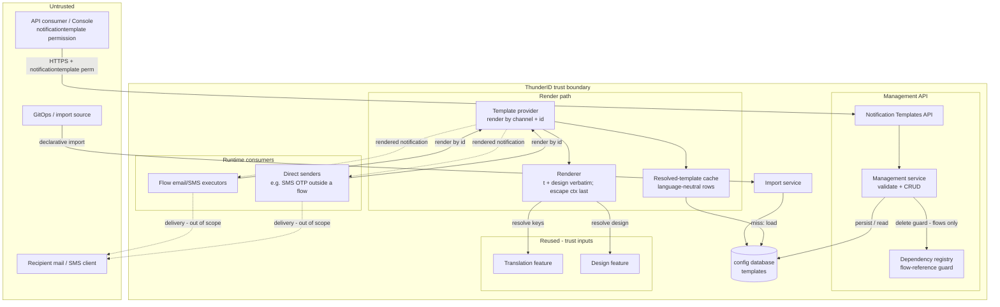
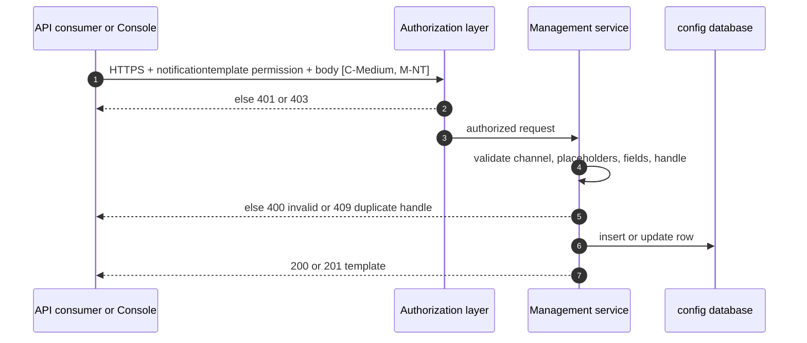
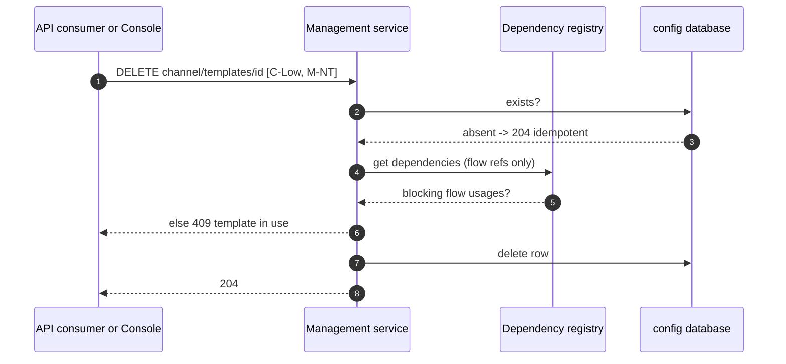
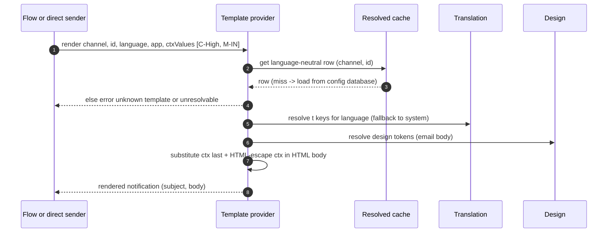
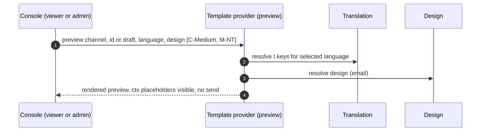

# Notification Templates Threat Model

This model covers the Notification Templates feature: the management API that administers email and SMS templates, the template provider that renders them for runtime consumers, and the Console preview. Translation values, design values, and the notification senders are consumed as trust inputs and are not analysed here. See the [specification](spec.md) for the feature design.

## Overview

ThunderID renders email and SMS notifications from templates whose content is authored by a privileged user and stored in the config database. A template is language-neutral: its `subject`/`body` are strings embedding `{{t(...)}}` translation-key references, `{{ctx(...)}}` runtime-value placeholders, and (email body only) `{{design(...)}}` tokens that reference the applicable design's values. At render time the template provider resolves the translation keys for the requested language, substitutes the runtime values, resolves the design tokens from the applicable design (per the template's selected color scheme), and returns finished content to the consumer, a flow executor or a direct sender such as the SMS OTP sender.

The security-relevant property of this feature is that **authored content and substituted runtime values are composed into content that is later delivered to a recipient's mail client**, carrying high-value data: an OTP body includes a one-time passcode substituted from runtime context. The primary concerns are authorization of the management surface, **safe substitution and output encoding at render**, and the integrity and availability of live template updates.

Cross-cutting concerns covered elsewhere, referenced here as trust inputs, not re-analysed:

- **API client authentication and the system resource-server permissions** that gate every management operation: covered by the [OAuth 2.0 Authorization and Core Grants](../oauth/authorization-and-core-grants/threat-model.md) model and the Token and Protocol Features model.
- **Flow execution** that selects a template and supplies `{{ctx(...)}}` values: covered by the Flow Execution model. The flow context is consumed here as a trust input, but its *rendering* into output is analysed here.
- **Translation resolution and authoring** that supply `{{t(...)}}` values: owned by the Translation feature, including its write permissions and value validation. Values are consumed here as trusted input.
- **Design resolution and authoring** that supply `{{design(...)}}` values and branding: owned by the Design feature, including its write permissions and value validation. Values are consumed here as trusted input.

## Conventions

**Materializable.** `Yes` marks a real threat that is **not fully prevented by a control in this design**: a bounded residual, carried in [Residual risks](#residual-risks-open-items). `No` marks a threat prevented by a control described in this model. A `Yes` that is an exploitable, unfixed hole does not belong in this public file; it is routed to a private advisory. The `Yes` rows here are accepted, bounded residuals or open design decisions.

**Confidentiality `[C-*]`:** `[C-High]` credential/OTP/PII-grade; `[C-Medium]` authored content that reaches users; `[C-Low]` identifiers only.

**Communication medium `[M-*]`:** `[M-NT]` network transport; `[M-DB]` database; `[M-FS]` filesystem; `[M-IN]` in-process / internal call.

## Permissions

Management is gated by fine-grained permissions under the `system` resource server, mapped per action and enforced by the authorization layer before the handler runs:

| Operation | Required permission |
| --- | --- |
| List / Read | `system:notificationtemplate:view` |
| Create | `system:notificationtemplate` |
| Update / Delete | `system:notificationtemplate` |

The `system` root permission is an ancestor that implies both. A read-only (`:view`) tier is therefore distinct from the write tier. The model does **not** add any per-application or per-organization-unit dimension: any holder of the write permission can modify **every** template in the deployment (see [01]-3 and Residual risks).

## Scope

ThunderID ships no default notification templates. Every template is created by a deployer through the API or declarative import, so there is no seeded content to protect, reset, or overwrite.

This model covers:

- The template management lifecycle (create, read, update, delete, list), its fine-grained authorization, input/placeholder validation, and the delete dependency guard
- The provider render path: translation resolution, `{{ctx(...)}}` substitution, design-token resolution, output encoding, and return of rendered content to the consumer
- The Console preview render path, which renders without sending
- Storage of templates in the config database

Out of scope (see the referenced companion models):

- Issuance and validation of the access token and its permissions that authorize the API, covered by the OAuth and Token and Protocol Features models
- The authentication flow and the *composition* of the `{{ctx(...)}}` values a flow supplies, covered by the Flow Execution model (their *rendering* into output is in scope here)
- Authoring of `{{t(...)}}` translation values and `{{design(...)}}` design values, including their write permissions and value validation, owned by the Translation and Design features. Their values are consumed here as trusted input and inserted verbatim (see the [HTML-content policy](#html-content-policy)).
- Notification senders and transport: SMTP and SMS transport security, the third-party SMS providers (Twilio, Vonage, custom), message assembly, and CR/LF and control-character handling of the subject and SMS body to prevent SMTP header injection. These are owned by the notification sender packages and their providers.
- Integrity of the declarative import source (GitOps repository/pipeline). This is deployer-owned. Imported content still flows through the render path, so the [HTML-content policy](#html-content-policy) applies to it the same as to API-authored content.
- Database and filesystem encryption and access control, assumed to be managed at the infrastructure layer
- Rate limiting and bot detection on the API, applied at the deployment or gateway layer
- **Notification cost abuse** (SMS pumping and email bombing driven by triggering notification-sending flows), owned by the Flow Execution model and deployment-layer rate limiting; this feature only supplies the rendered content
- The recipient's mail client rendering and sanitization behaviour, once the message leaves ThunderID

## Architecture


```mermaid
flowchart TB
  subgraph Untrusted
    ADMINCLIENT["API consumer / Console<br/>notificationtemplate permission"]
    RECIPIENT["Recipient mail / SMS client"]
    GITOPS["GitOps / import source"]
  end

  subgraph Trusted [ThunderID trust boundary]
    direction TB
    subgraph api [Management API]
      API["Notification Templates API"]
      MGMT["Management service<br/>validate + CRUD"]
      DEP["Dependency registry<br/>flow-reference guard"]
    end

    subgraph render [Render path]
      PROVIDER["Template provider<br/>render by channel + id"]
      RENDER["Renderer<br/>t + design verbatim; escape ctx last"]
      CACHE["Resolved-template cache<br/>language-neutral rows"]
    end

    subgraph reused [Reused - trust inputs]
      I18N["Translation feature"]
      DESIGN["Design feature"]
    end

    subgraph consumers [Runtime consumers]
      FLOW["Flow email/SMS executors"]
      DIRECT["Direct senders<br/>e.g. SMS OTP outside a flow"]
    end

    IMPORT["Import service"]
    CONFIGDB[("config database<br/>templates")]
  end

  ADMINCLIENT -->|"HTTPS + notificationtemplate perm"| API
  API --> MGMT
  MGMT -->|"persist / read"| CONFIGDB
  MGMT -->|"delete guard - flows only"| DEP
  GITOPS -->|"declarative import"| IMPORT --> CONFIGDB

  FLOW -->|"render by id"| PROVIDER
  DIRECT -->|"render by id"| PROVIDER
  PROVIDER --> CACHE
  CACHE -->|"miss: load"| CONFIGDB
  PROVIDER --> RENDER
  RENDER -->|"resolve keys"| I18N
  RENDER -->|"resolve design"| DESIGN
  PROVIDER -. "rendered notification" .-> FLOW
  PROVIDER -. "rendered notification" .-> DIRECT
  FLOW -. "delivery - out of scope" .-> RECIPIENT
  DIRECT -. "delivery - out of scope" .-> RECIPIENT
```

### Components

| Component | Task |
| --- | --- |
| Notification Templates API | REST surface for the template lifecycle. Each route requires the matching `notificationtemplate` permission (read vs write), enforced by the authorization layer, not in the handler. |
| Management service | Validates channel, placeholder syntax, required fields, color scheme, and `handle` uniqueness; performs create/read/update/delete; rejects an update that changes the immutable `handle`. |
| Dependency registry | Reports whether a template is referenced **by a flow**. A delete of a flow-referenced template is rejected with `409`. It does not cover direct (non-flow) senders ([02]). |
| Template provider | The narrow, read-only interface runtime consumers use. Resolves a template by its channel and id, localizes, resolves design tokens, substitutes `{{ctx(...)}}`, and returns finished content, failing closed on any unresolved placeholder. Consumers never call the management service, Translation, or Design directly. |
| Renderer | Resolves placeholders in a fixed order (`t` → `design` → `ctx`) in a single pass with no re-evaluation, **HTML-escaping only the untrusted `{{ctx(...)}}` values and only in an HTML body**; translation and design values are inserted verbatim (see the [HTML-content policy](#html-content-policy)). |
| Resolved-template cache | A write-through read cache over the store, serving the hot render path from cached **language-neutral template rows**, never substituted output. Create/update re-cache the row, delete invalidates; list/count/uniqueness resolve from the source of truth. |
| Translation feature | Resolves `{{t(...)}}` keys for the requested language, with fallback. Trust input; authoring and validation owned by the Translation feature. |
| Design feature | Resolves `{{design(...)}}` tokens and branding composed onto email, at the application tier in this model. Trust input; authoring and validation owned by the Design feature. |
| Import service | Declaratively imports deployer-supplied templates into the config database. It seeds nothing by default. Imported content is rendered through the same path, so the HTML-content policy applies to it; import-source integrity is deployer-owned (Out of scope). |
| Config database (templates) | Deployment-scoped, mutable store of templates and their language-neutral content. |

### Actors

| Actor | Description | Roles or permissions |
| --- | --- | --- |
| Template administrator | Creates, edits, and deletes templates through the API or Console. | `system:notificationtemplate` (write) |
| Template viewer | Reads/lists templates (for example a read-only operator or dashboard). | `system:notificationtemplate:view` |
| Recipient (end user) | Receives the rendered email or SMS. Does not touch the management surface; is the target of the content trust boundary, and the source of some `{{ctx(...)}}` values (for example a self-registered display name). | N/A |
| Malicious actor | External, or an authenticated lower-privileged user, attempting to inject HTML/script or phishing content through an untrusted ctx value, break a consumer by deleting a referenced template, or disrupt rendering. | N/A |

#### Entitlement matrix

| Actor | Read / list | Create / update | Delete |
| --- | --- | --- | --- |
| Template administrator | Yes (`:view` implied) | Yes | Yes, unless flow-referenced (`409`) |
| Template viewer | Yes (`:view`) | No | No |
| Recipient (end user) | No | No | No (but influences ctx values) |
| Malicious actor | Only with a stolen `:view` token | Only with a stolen write token | Only with a stolen write token |

### External Dependencies (not owned)

| Dependency | Description |
| --- | --- |
| OAuth token service and system permissions | Issue and validate the access token and the `notificationtemplate` permissions that authorize each call. Decision authority for API access. OAuth / Token and Protocol Features models. |
| Translation feature | Resolves `{{t(...)}}` keys with fallback; its stored values reach delivered content. Authoring, write permissions, and validation are owned by the Translation feature. |
| Design feature | Resolves `{{design(...)}}` tokens and branding (CSS, logo URLs) composed into email. Authoring, write permissions, and validation are owned by the Design feature. |
| Flow engine / direct senders | Supply the template identifier (channel and id), language, application context, and `{{ctx(...)}}` values at render. Values are a trust input; the OTP value is sensitive. Flow Execution model. |
| GitOps / import source | Supplies declarative template definitions. Integrity of the source repository/pipeline is deployer-owned (Out of scope). |
| Config database | Stores template rows. Encryption at rest and access control are infrastructure-layer. |

## Threats and mitigations

### HTML-content policy

The render path composes an email from several sources that are trusted differently. The design's rule is a **source-trust model**: content from privileged authoring surfaces is inserted verbatim, and only caller-supplied runtime data is escaped. Resolution runs in a fixed order (translations, then design tokens, then context **last**) so a context value can never be reinterpreted by a later pass.

| Source | Trust | Render policy for email |
| --- | --- | --- |
| Authored `body` (HTML) | Trusted: privileged author (`system:notificationtemplate`) | Inserted **verbatim** as the message HTML; markup is intended. There is no output sanitizer: integrity rests on the write permission (and, as a residual, audit). A compromised or over-granted writer is the residual ([01]-2/3). |
| `{{t(...)}}` values | Trusted: admin-authored, may legitimately contain markup | Inserted **verbatim**. The control is the Translation feature's write boundary, not encoding. |
| `{{design(...)}}` values | Trusted: theme-authored, with the design service's own defense in depth | Inserted **verbatim**. The control is the Design feature's write boundary. |
| `{{ctx(...)}}` values | **Untrusted**: caller/flow data, may originate from an end user | **HTML-escaped** in the HTML (email) body, and substituted **last** so no later pass reinterprets it. URL-scheme validation for a ctx value placed in a link/`src` is **not** part of the escaping contract; see [03]-3. |
| `subject` / SMS body | Plain text | Not an HTML context, so ctx is substituted without HTML escaping. |

### Interactions

#### [01]: Template lifecycle management

**Description**

A privileged client creates, reads, updates, or deletes a template through the API. The matching `notificationtemplate` permission is enforced before the handler (read vs write). The management service validates the channel, placeholder syntax (only `ctx`, `t`, and `design` functions over a restricted key charset, with `design` restricted to the email body), required fields, color scheme, and per-channel `handle` uniqueness, rejects an update that changes the immutable `handle`, and persists the row.

**Assets involved**

| Initiator | Intermediate | Target |
| --- | --- | --- |
| API consumer / Console (privileged) | Authorization layer | Management service and the template store |

**Data flow**


```mermaid
sequenceDiagram
  autonumber
  participant C as API consumer or Console
  participant MW as Authorization layer
  participant MGMT as Management service
  participant DB as config database

  C->>MW: HTTPS + notificationtemplate permission + body [C-Medium, M-NT]
  MW-->>C: else 401 or 403
  MW->>MGMT: authorized request
  MGMT->>MGMT: validate channel, placeholders, fields, handle
  MGMT-->>C: else 400 invalid or 409 duplicate handle
  MGMT->>DB: insert or update row
  MGMT-->>C: 200 or 201 template
```

**Security considerations**

| Area | Response | Comments |
| --- | --- | --- |
| Data confidentiality | [C-Medium] | Authored config, not secret, but it determines delivered content; integrity matters more than confidentiality. |
| Communication medium | [M-NT] | |
| Transport security | TLS | |
| Authentication | `notificationtemplate` permission | Read tier (`:view`) vs write tier. |
| Accessibility | Restricted | No anonymous path. |
| Authorization and Access Control | Per-action permission; no resource-level isolation | Write requires `system:notificationtemplate`, read `:view`. `handle` is immutable and unique per channel (`409` on conflict). No per-app/per-OU dimension: any writer can edit every template ([01]-3). |

**Threat assessment**

| ID | Category | Threat | Materializable | Mitigation / comment |
| --- | --- | --- | --- | --- |
| 1 | Elevation of privilege | An unauthorized or read-only caller creates or edits a template. | No | Write routes require `system:notificationtemplate`; read routes require `:view`. Enforced before the handler. |
| 2 | Repudiation | A template is changed with no record of who changed it or what changed. | Yes | No standardized audit log of create/update/delete or before/after content; a malicious or mistaken change (for example a phishing link) cannot be attributed or diffed. Residual. |
| 3 | Elevation of privilege | Coarse authority: any holder of `system:notificationtemplate` can modify **every** template globally, with no per-application or per-OU isolation. | Yes | The write permission is deployment-wide; a single over-granted token can rewrite all notifications. Residual: a narrower resource-scoped permission and least-privilege issuance. |

#### [02]: Template deletion with dependency guard

**Description**

A privileged client deletes a template. The delete is idempotent (absent → success) and is rejected with `409` when the dependency registry reports a **flow** referencing the template. The registry reports flow references only.

**Assets involved**

| Initiator | Intermediate | Target |
| --- | --- | --- |
| API consumer / Console (privileged) | Dependency registry (flows only) | Management service and the template store |

**Data flow**


```mermaid
sequenceDiagram
  autonumber
  participant C as API consumer or Console
  participant MGMT as Management service
  participant DEP as Dependency registry
  participant DB as config database

  C->>MGMT: DELETE channel/templates/id [C-Low, M-NT]
  MGMT->>DB: exists?
  DB-->>MGMT: absent -> 204 idempotent
  MGMT->>DEP: get dependencies (flow refs only)
  DEP-->>MGMT: blocking flow usages?
  MGMT-->>C: else 409 template in use
  MGMT->>DB: delete row
  MGMT-->>C: 204
```

**Security considerations**

| Area | Response | Comments |
| --- | --- | --- |
| Data confidentiality | [C-Low] | A delete carries only an identifier. |
| Communication medium | [M-NT] | |
| Transport security | TLS | |
| Authentication | `system:notificationtemplate` (write) | |
| Accessibility | Restricted | |
| Authorization and Access Control | Write permission + flow-reference guard | A flow-referenced template cannot be deleted; the guard fails closed on a resolution error. The guard does not see direct (non-flow) senders ([02]-2). |

**Threat assessment**

| ID | Category | Threat | Materializable | Mitigation / comment |
| --- | --- | --- | --- | --- |
| 1 | Denial of service | Deleting a template a **flow** sends, breaking that flow's notification. | No | The dependency registry is consulted and a blocking flow usage returns `409`; resolution failure fails closed. |
| 2 | Denial of service | Deleting a template a **direct sender** is configured to use (for example SMS OTP sent outside a flow) silently breaks that notification, because the registry reports flow references only. | Yes | Direct-sender usage is not registered as a dependency, so the `409` guard does not fire. Residual: cover direct senders in the dependency model. |

#### [03]: Rendering through the provider

**Description**

A runtime consumer (flow executor or direct sender) calls the provider with the template's channel and id, the language, the application context for design, and the `{{ctx(...)}}` values. The provider resolves placeholders in a fixed order, `{{t(...)}}` translations, then `{{design(...)}}` tokens (email body only), then `{{ctx(...)}}` values **last**, and HTML-escapes only the untrusted `{{ctx(...)}}` values, and only in an HTML body, per the [HTML-content policy](#html-content-policy). It fails closed on any unresolved placeholder and returns the rendered content to the consumer. This is where authored content and runtime values are composed into the message that is later delivered to the recipient.

**Assets involved**

| Initiator | Intermediate | Target |
| --- | --- | --- |
| Flow executor / direct sender | Template provider, renderer, Translation, Design | Rendered notification returned to the consumer |

**Data flow**


```mermaid
sequenceDiagram
  autonumber
  participant CONS as Flow or direct sender
  participant PROV as Template provider
  participant CACHE as Resolved cache
  participant I18N as Translation
  participant DESIGN as Design

  CONS->>PROV: render channel, id, language, app, ctxValues [C-High, M-IN]
  PROV->>CACHE: get language-neutral row (channel, id)
  CACHE-->>PROV: row (miss -> load from config database)
  PROV-->>CONS: else error unknown template or unresolvable
  PROV->>I18N: resolve t keys for language (fallback to system)
  PROV->>DESIGN: resolve design tokens (email body)
  PROV->>PROV: substitute ctx last + HTML-escape ctx in HTML body
  PROV-->>CONS: rendered notification (subject, body)
```

**Security considerations**

| Area | Response | Comments |
| --- | --- | --- |
| Data confidentiality | [C-High] | The rendered notification can carry an OTP or other sensitive `{{ctx(...)}}` value. |
| Communication medium | [M-IN] | In-process; delivery to the recipient is owned by the senders (Out of scope). |
| Transport security | N/A | In-process call. |
| Authentication | None at the provider | Internal interface; callers are trusted runtime components, not reachable externally. |
| Accessibility | Internal | Not exposed as an API. |
| Authorization and Access Control | Caller-supplied channel + id + context | The provider renders exactly the requested template with no extra authorization; the caller is trusted. Safety rests on the source-trust escaping model and the ctx-exposure policy, not authorization. |

**Threat assessment**

| ID | Category | Threat | Materializable | Mitigation / comment |
| --- | --- | --- | --- | --- |
| 1 | Elevation of privilege | Stored XSS / unwanted markup injected by a **non-privileged** actor via the email body. | No | A non-privileged actor cannot author the body: it requires `system:notificationtemplate`, and runtime `{{ctx(...)}}` data is HTML-escaped. (The authored body itself is trusted and inserted verbatim, with no sanitizer, so a *compromised/over-granted author* is a separate residual, [01]-2/3.) |
| 2 | Information disclosure | HTML/attribute injection via a `{{ctx(...)}}` value (for example a self-registered display name containing `<...>` or `"`) leading to markup breakout in the body. | No | Ctx values are HTML-escaped in the HTML email body and substituted last, so a value is emitted as data, never as new markup. |
| 3 | Spoofing | URL-scheme injection: an end-user-influenced `{{ctx(...)}}` value placed in a link/`src` by the template author is `javascript:` or `data:`. | Yes | HTML-escaping does not neutralize a URL scheme, and scheme validation is not part of the escaping contract (the renderer does not parse HTML to know where a placeholder sits). Accepted residual, bounded by author responsibility: place only server-generated values (for example a magic-link URL) in URL attributes, and keep user-influenced ctx keys out of them. The per-purpose ctx allowlist (see Residual risks) limits which keys a template can reference. |
| 4 | Elevation of privilege | Template injection: a ctx/t/design value containing `{{...}}` is re-evaluated. | No | Substitution is a single pass with no re-scan of resolved values, and the placeholder key charset is restricted at authoring. |
| 5 | Denial of service | Template expansion: nested/self-referencing values are re-evaluated (recursive blow-up). | No | The fixed order (`t` → `design` → `ctx`) is applied once and resolved values are not re-scanned, so a `{{...}}` appearing inside a resolved value is not re-substituted. |
| 6 | Denial of service | An unresolvable template/key delivers an empty/half-rendered OTP or blocks the notification. | No | Language resolution falls back (best match → system language); an unknown template, a key missing in every language, or a missing required ctx value fails the render closed with a surfaced error rather than returning empty/fabricated content (spec R2/AC2.3). |
| 7 | Information disclosure | A render error message leaks template internals or a ctx value to the **end user**. | No | Errors surface to the caller and logs only; they never enter rendered content and do not echo ctx values or internal keys. |
| 8 | Information disclosure | A ctx value (OTP) is logged on the render path. | No | The render path logs identifiers, not resolved content or ctx values. |
| 9 | Tampering | A stale cache serves superseded template content after an update. | No | The read cache holds only language-neutral template rows (never substituted output), is write-through (create/update re-cache, delete invalidates), and always resolves list/count/uniqueness from the source of truth. (Cross-node cache coherence in a multi-instance deployment is a smaller residual, see Residual risks.) |

#### [04]: Preview in the Console

**Description**

A privileged user previews a template or a flow's selected template. Preview uses the same content/translation/design resolution as the render path but leaves `{{ctx(...)}}` visible and never sends.

**Assets involved**

| Initiator | Intermediate | Target |
| --- | --- | --- |
| Console (privileged) | Preview render path (no send) | Rendered preview shown in the browser |

**Data flow**


```mermaid
sequenceDiagram
  autonumber
  participant UI as Console (viewer or admin)
  participant PROV as Template provider (preview)
  participant I18N as Translation
  participant DESIGN as Design

  UI->>PROV: preview channel, id or draft, language, design [C-Medium, M-NT]
  PROV->>I18N: resolve t keys for selected language
  PROV->>DESIGN: resolve design (email)
  PROV-->>UI: rendered preview, ctx placeholders visible, no send
```

**Security considerations**

| Area | Response | Comments |
| --- | --- | --- |
| Data confidentiality | [C-Medium] | Reflects authored content/design; no runtime context, so no OTP/recipient data. |
| Communication medium | [M-NT] | |
| Transport security | TLS | |
| Authentication | `notificationtemplate` permission | A preview reads a template, so at least `:view`. |
| Accessibility | Restricted | |
| Authorization and Access Control | Permission + no side effects | Preview never sends and never substitutes ctx, so no runtime data is exposed. |

**Threat assessment**

| ID | Category | Threat | Materializable | Mitigation / comment |
| --- | --- | --- | --- | --- |
| 1 | Tampering | Authored/translated HTML executes script in the Console origin when previewed (DOM XSS against the admin). | No | The preview renders in a sandboxed iframe without `allow-scripts`, so content cannot run script in the Console origin. |
| 2 | Information disclosure | Preview loads remote resources (image `src`, CSS) leading to a tracking pixel or admin-IP/host leak to a third party. | Yes | A preview CSP restricting remote loads (`img-src`/`connect-src`/`style-src`) or asset proxying is required; the remote-resource policy is an open design residual shared with delivered email (see Residual risks). |
| 3 | Information disclosure | Preview leaks runtime recipient data. | No | Preview has no runtime context; ctx placeholders are shown literally and nothing is sent. |

## Security Review Checklist

A review aid that complements the threat model. Guidance follows the [OWASP Top 10 Proactive Controls](https://top10proactive.owasp.org/).

### Security considerations

| # | Consideration | State | Comments |
| --- | --- | --- | --- |
| 1 | Are all inputs and outputs validated (syntactic and semantic)? | Partial | Inputs validated at create/update (channel, placeholder syntax, fields, color scheme, handle uniqueness). On output, untrusted `{{ctx(...)}}` values are HTML-escaped per the source-trust [HTML-content policy](#html-content-policy); trusted sources are verbatim, so the URL-scheme and remote-resource decisions ([03]-3, [04]-2) remain open. Translation and design write boundaries are owned by those features. |
| 2 | Are rate limits in place where necessary? | N/A | Deployment/gateway layer; notification cost abuse owned by the Flow model. |
| 3 | Are permissions, roles, and entitlements defined on least privilege and business need? | Partial | Fine-grained read (`:view`) vs write (`system:notificationtemplate`) exists, but the write permission is deployment-wide (no per-app/OU) ([01]-3). Translation and design writers are separate boundaries owned by those features. |
| 4 | Are authN and authZ validated at both UI and API layers, before granting access? | Yes | Each route is gated by the matching `notificationtemplate` permission; the Console calls the same API. |
| 5 | Are isolations in place to reduce blast radius / lateral movement? | Partial | Runtime consumers depend only on the read-only provider, not the management service; but a single write permission spans all templates ([01]-3). |
| 6 | Default credentials changed / no default superuser (third-party components)? | N/A | |
| 7 | Followed best-practice guidelines (OWASP, etc.)? | Partial | A source-trust escaping model (untrusted ctx HTML-escaped, substituted last, single pass) and preview sandboxing follow OWASP injection/XSS guidance; URL-scheme allowlisting for ctx values in link/`src` attributes is not part of the contract ([03]-3). |
| 8 | Secrets/credentials kept out of the source tree and git history? | Yes | Templates hold no secrets; ctx values (OTPs) are supplied at runtime, never stored. |
| 9 | Security-focused code review conducted and findings addressed? | Yes | Covered by the product scan and this review. |
| 10 | SAST / IaC scanning conducted and findings addressed? | Yes | Covered by the product scan. |
| 11 | SCA conducted/integrated and findings addressed? | Yes | Covered by the product scan. |
| 12 | DAST / API scanning on a non-production setup? | Yes | Covered by the product scan. |
| 13 | Standardized audit logs for critical functionality? | No | Create/update/delete of templates are not audit-logged. Residual ([01]-2). |
| 14 | Do audit logs record before/after for critical config changes? | No | No before/after capture of template content. Residual. |
| 15 | Data in transit and at rest encrypted? | Partial | TLS in transit (deployer-configured); at-rest encryption of the config database is infrastructure-layer. |
| 16 | Secrets stored in a vault/secret store? | N/A | Templates store no secrets. |
| 17 | Personal/sensitive data kept out of logs? | Yes | The render path logs only identifiers, not resolved content or ctx values ([03]-8). |
| 18 | Clear instructions for secure usage? | Partial | Document least-privilege issuance of `notificationtemplate`, placing only server-generated values in URL attributes, and not embedding secrets or hostile remote resources in content. |

### Business impact and resilience

For an open-source component, most of these are shared with the deployer.

| # | Consideration | State | Comments |
| --- | --- | --- | --- |
| 1 | Business impact analysis for resilience (MTD, uptime, RPO, RTO)? | N/A | Left to the deployer. Template availability gates notification rendering (for example OTP email), so templates and the config database belong in the deployer's backup/HA scope. |

Resilience details to record:
- High availability / disaster recovery: not defined at the project level
- Backups: templates live in the config database, covered by that database's backup policy (deployer-owned)
- Health checks / user banners: not applicable at the project level

### Dependency and component health

| # | Consideration | State | Comments |
| --- | --- | --- | --- |
| 1 | Dependencies/base images/runtimes monitored and current? | Yes | Covered by the product's SCA. |
| 2 | Any EOL/EOS components in use? | No | |
| 3 | Hardening guidance published for operators? | No | Not yet published for this feature. |

### Privacy considerations

| # | Consideration | State | Comments |
| --- | --- | --- | --- |
| 1 | Purpose/legal basis for personal-data processing defined? | Partial | Templates hold no personal data; rendered notifications carry recipient-directed values (OTP) supplied at runtime. |
| 2 | Collection/storage/processing aligned with data minimization? | Yes | The template stores no recipient data; ctx values are substituted transiently at render and not persisted by this feature. |
| 3 | Personal data stored securely? | N/A | No personal data stored by the template store. |
| 4 | Privacy notices updated? | N/A | No new persisted processing. |
| 5 | Access to personal data on need-to-know? | Partial | Rendered content is returned only to the requesting runtime consumer; the remote-resource control ([04]-2) bounds third-party leakage of recipient data. |
| 6 | Data retention considered? | N/A | Templates are configuration; no recipient data retained. |
| 7 | Timely disposal of personal data on request? | N/A | No recipient data persisted. |
| 8 | Records of processing in the data inventory? | N/A | |

## Residual risks (open items)

| Risk | Description | Current status | Recommendation |
| --- | --- | --- | --- |
| Remote resources in email leak recipient data | A remote `img`/`src` in the authored body or a design value causes the recipient's client to call a third-party host on open, leaking IP/open data and (if a ctx value is in the URL) the substituted value ([04]-2). Output encoding constrains markup but not a well-formed external URL. | Open design decision. | Expose ctx to templates through a **per-purpose allowlist** rather than the whole flow context; add a remote-resource policy (allowlist/proxy external hosts) for email bodies and preview. |
| Untrusted ctx values in URL attributes | Untrusted `{{ctx(...)}}` values are HTML-escaped in the body, but a ctx value used in a link/`src` is not scheme-validated ([03]-3). Enforcing this at render would require HTML parsing and cannot distinguish a legitimate `href="{{ctx(link)}}"` from a risky one. | Accepted. | Author guidance: place only server-generated values in URL attributes. Limit exposure with the per-purpose ctx allowlist above, so user-influenced keys are not available to URL positions. |
| Verbatim trusted content and its writer boundaries | Authored body, `{{t(...)}}` values, and `{{design(...)}}` values are inserted **verbatim** (no sanitizer) by design, so integrity rests entirely on their write boundaries. The template-write boundary is covered in [01]; the translation and design write boundaries are owned by those features. A compromised or over-granted writer of any of the three can inject markup/active content into email. | Open / accepted. | Least-privilege issuance of `system:notificationtemplate`; see the Translation and Design models for their write boundaries. Consider sanitizing authored output as defense in depth; pair with audit logging. |
| Delete guard misses direct senders | The dependency registry reports flow references only; deleting a template a direct sender (SMS OTP) is configured to use is not blocked ([02]-2). | Open. | Cover direct senders in the dependency model. |
| Coarse, global write permission | `system:notificationtemplate` grants edit over every template in the deployment; no per-app/OU scoping ([01]-3). | Accepted this phase. | Add a narrower/resource-scoped permission; issue the write permission sparingly. |
| Cross-node cache coherence | The read cache holds only unresolved rows and invalidates on write, but cross-node coherence in a multi-instance deployment is not specified ([03]-9). | Open. | Specify cross-node cache invalidation. |
| No standardized audit logging | Create/update/delete of templates are not audit-logged, with no before/after diff ([01]-2). | Accepted; product-wide gap. | Add structured audit logging with actor and before/after values and a retention policy. |

## Appendix

- Sample requests and configurations: see the API examples in [spec.md](spec.md#api).
- References: [Notification Templates specification](spec.md); design [discussion #5388](https://github.com/thunder-id/thunderid/discussions/5388); OWASP Top 10 Proactive Controls. Companion models: OAuth 2.0 Authorization and Core Grants, Token and Protocol Features, Flow Execution.

A minimal email-template create request (requires `system:notificationtemplate`):

```http
POST /notification-templates/email/templates
Authorization: Bearer <access token with system:notificationtemplate>
Content-Type: application/json

{
  "handle": "otp-verification",
  "displayName": "OTP Verification",
  "description": "One-time passcode sent to verify a user's email address.",
  "design": { "colorScheme": "light" },
  "content": {
    "subject": "{{t(notification.otp.email.subject)}}",
    "body": "<p>{{t(notification.otp.email.message)}}</p><p>{{ctx(otp)}}</p>"
  }
}
```

### Sample audit logs

N/A. See Residual risks (no standardized audit logging yet).

## Change log

| Version | Date | Change |
| --- | --- | --- |
| 0.1 | 2026-10-04 | Initial threat model for the notification templates feature, authored alongside the specification. |
